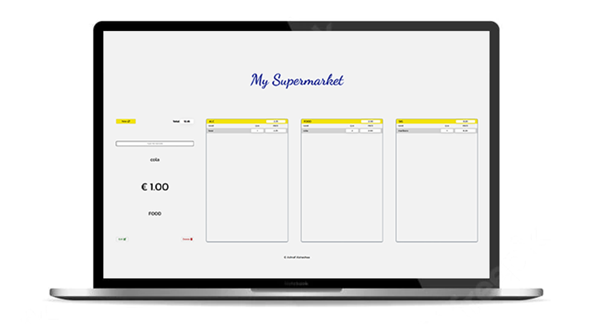

# Description

A simple browser application that uses Local Storage to store data
it is a scanner reader that searches for products and adds them to the invoice.

_try the app [hier](https://ashraf-alshashaa.github.io/My-Supermarket-POS/)_

---

## You can by using it

- Add a product using the barcode reader or typing via the keyboard

- Add a name, price, and specify the product category

- Modify or delete the product

- Add The product to the invoice in the category in which it was classified

- Have the final price for all items for each category,

- Have the final price the invoice.
